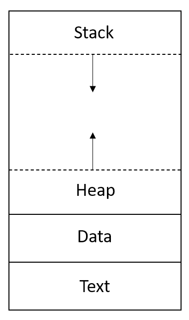
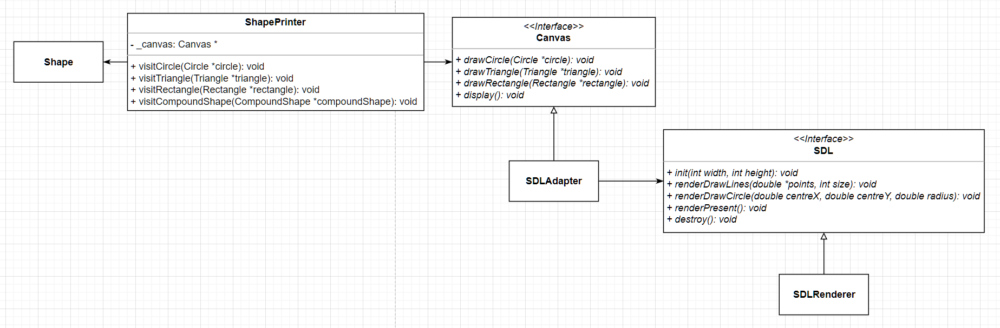
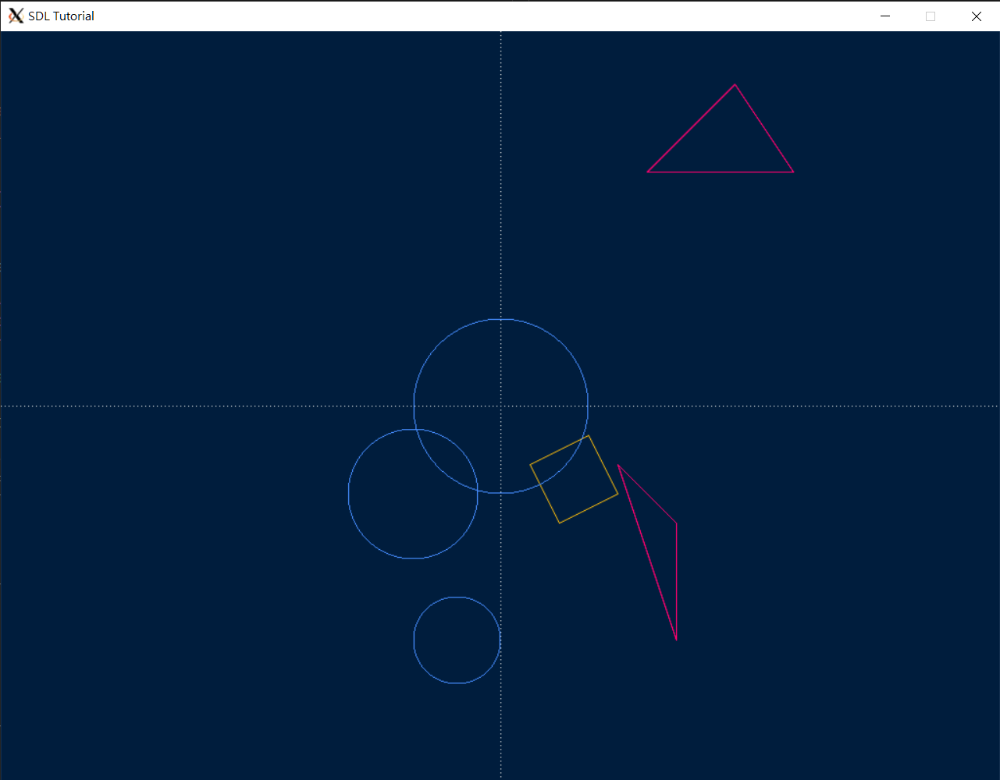
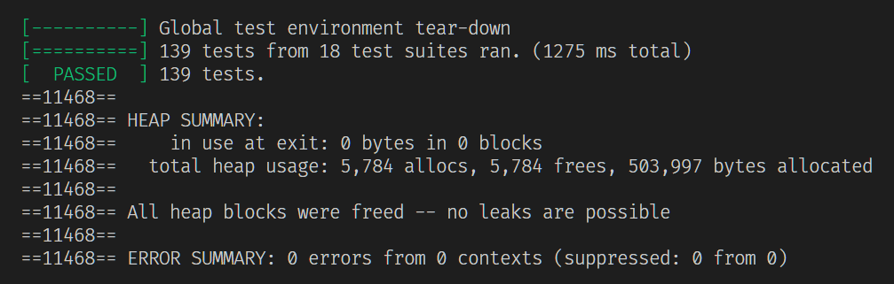
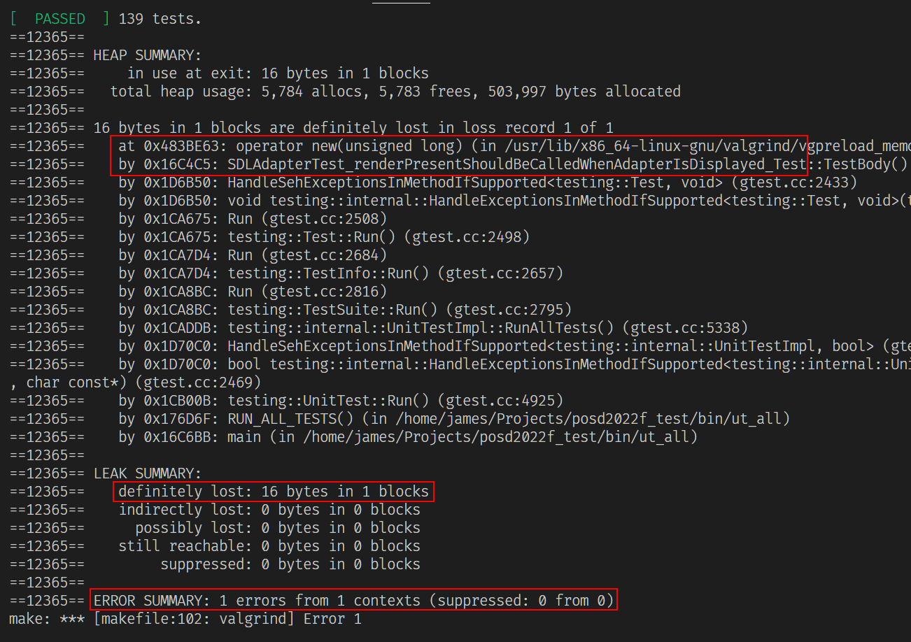

# Pattern Oriented Software Design 2022 Fall Assignment

## Assignment 5

#### Deadline: 12/12 Mon. 23:59

## Introduction

In this assignment, you are required to refactor the interface of the shape family with [Valgrind](https://valgrind.org/) for memory leak elimination and to implement an `Adapter` to a library: [SDL](https://www.libsdl.org/) for visualization.

The deadline is at 23:59, 12/12(Mon.).


## Problem statement

### 1. The elimination of memory leak

The first topic of this assignment is the elimination of memory leak. In the previous assignments, we were not required to manage the memory usage in either source code or unit tests. This time we are going to eliminate all leaks we have made by a tool: [Valgrind](https://valgrind.org/) and learn how to avoid the same issue happens in the future.

Memory leak is that a resource allocated in memory is no longer used and is not released. The resource settles in memory like vagrants. Along with the time passed, the memory space gets lesser and lesser, and the program gets slower and slower. This may happen when the programmer forgets to release the resource or when the **ownership** of the resource is not determined. The ownership of a resource is a responsibility for deleting the resource, meaning that, in terms of OOD, which object should be responsible for deleting the resource after all. Except the situation that the programmer forgets, which object has the ownership should be determined.

When a C++ program executes, it has a memory layout as shown below. The *Text* section stores the code executed. The *Data* stores some static or global data. The *Heap* stores allocated data. The *Stack* section stores local data such as local variables in function. The *Heap* and *Stack* sections will changes based on the code executed.

<div align="center">
  
</div>

In C++, whenever we create an instance by **new**, the instance is allocated in Heap. Taking the example below, we use **new** to create an instance of `Circle` and declare a pointer pointing to the instance. In this case, the `Circle` instance will be allocated and stored in Heap and the pointer will be created and stored in Stack. When the function ends, the pointer will be automatically removed but the instance will be remained in Heap if we do not use **delete** to delete it, in which a memory leak occurs.
```c++
class A {
  void function() {
    Circle *circle = new Circle(...);
    ...
  }
};
```

We should use **delete** to release the resource allocated in Heap. For the same example, we say class `A` has the ownership of the `Circle` instance, meaning that class `A` should be responsible for deleting the instance. On the other hand, we can pass the instance to other object, such as the caller of the `function`. In this case, we should determine the caller having the ownership of the instance. The caller should **delete** the instance after the instance is used. For more details about memory leak in C++, you can refer to [this website](https://courses.engr.illinois.edu/cs225/fa2022/resources/stack-heap/).

```c++
class A {
  void function() {
    Circle *circle = new Circle(...);
    ...
    delete circle;
  }
};
```

In this assignment, we are going to refactor the interface of the shape family for memory leak elimination. Precisely say, we refactor the interface to get rid of the determination of the ownership of the objects allocated.

The main modification of the refactoring is using passing by value instead of passing by reference. Previously we used pointers extensively to pass objects. The ownership of these objects is not determined, so sometimes these objects get deleted and sometimes not. The problem using passing by reference is that we treat `Point` and `TwoDimensionalVector` reusable. When we pass a `Point` instance for a circle and use the same `Point` instance for another shape such as a rectangle. Who should be responsible for deleting the `Point`? None of them, because either one will get segmentation fault as it deletes an instance that has already been deleted by another shape.

If we do not reuse `Point` or `TwoDimensionalVector`, we still have the problem when we use `ShapeParser` and `ShapeBuilder`. When we use `ShapeParser` or `ShapeBuilder`, they create the instances of `Point` and `TwoDimensionalVector` but they do not delete the instances. From the perspective of responsibility, `ShapeParser` should focus on parsing the input file, and `ShapeBuilder` should focus on building shapes. Neither should take the responsibility of deleting the instances of `Point` and `TwoDimensionalVector`.

**We use passing by value instead.** By doing so, we do not need to **new** instance until necessary. If we do not use **new**, we do not need to delete the instance later and do not need to determine who has the ownership. No instance will be remained in Heap anymore; therefore there is no memory leak.

Taking the two example below, for the class `A`, the `Circle` instance will be automatically removed when the `function` ends. No instance is remained in Heap. For the class `B`, if the `Rectangle` instance should be returned, it will be copied. The original instance will be automatically removed when the `function` ends. No instance is remained in Heap.
```c++
class A {
  void function() {
    Circle circle(...);
    ...
  }
};

class B {
  Rectangle function() {
    Rectangle rectangle(...);
    ...
    return rectangle;
  }
};
```

### 2. An adapter for visualization

Another topic of this assignment is that we are going to visualize our shapes. To realize this function, we use a graphics library called [SDL](https://www.libsdl.org/) (Simple DirectMedia Layer). As expected, the interface of SDL is not directly compatible to our shape family. We need some extra classes to help us to draw shapes on the screen. In the following, we introduce what is SDL and how to use it and explain what extra classes we need.

SDL is a graphics library used to draw pixels on the screen. It is also cross-platform, working on Windows, Linux, or MacOS. [Here is a simple example](materials/SDL/01_hello_SDL.cpp). In the example, a 640x480 window is opened and painted all over in white. A while-loop is triggered for detecting whether a close event appears. If the close button of the window is clicked, a close event will be generated, and then the while-loop will detect the event and then stop. The window will be closed after the loop stops.

As you can see, even a simple function: painting all over the window in white, requires a lot of code to correctly set up the SDL library; we do not have enough time to read and learn the whole SDL library. Fortunately, in this assignment the minimal code to draw shapes has been encapsulated in a class named `SDLRenderer`. We can easily call the public methods of the `SDLRenderer` to draw shapes. In other words, **we are NOT required to implement `SDLRenderer`.**

Below is the class diagram of the `SDLRenderer` and the extra classes we needs. Since we first talk about `SDLRenderer`, we explain the diagram from right to left.

<div align="center">
  
</div>

`SDLRenderer`, as we mentioned, contains the minimal code for drawing shapes. It inherits from an interface: `SDL`. We can see there are some public methods, which are relatively intuitive to use. We focus on the `renderDrawLines` and `renderDrawCircle` methods. `renderDrawLines` is responsible for drawing lines by points. If we give it two points, A and B, with size: 2. This method will draw a line from A to B on the screen. If we give it three points, A, B, and C, with size 3, then it will draw *two lines*. The first line goes from A to B, and the second line goes from B to C. On the other hand, `renderDrawCircle` is responsible for drawing a circle by giving a center and a radius. If we give it a center (-8, 3) with the radius 4, the method will draw a circle having the radius 4 at (-8, 3). However, we cannot directly use these two methods, as we have three kinds of shapes and there are only two kinds of methods and as these two methods mainly take points in double while our shapes only provides `Point`s in std::set. We need an adapter to fulfill the gap between shape and SDL.

In the middle of the diagram is `SDLAdapter` and its interface class `Canvas`. `Canvas` is the main interface of the graphics function. It defines the standard drawing methods for each kind of shape. If we have a graphics library that have the same interface as `Canvas`, we can directly inherit the library from `Canvas`, but we do not. **We need an adapter, `SDLAdapter`, which is the one requires you to implement.** `SDLAdapter` is responsible for converting the interface of `Canvas` to the interface of `SDL`. For instance, to draw a triangle, `SDLAdapter` should override the `drawTriangle` method from `Canvas` and invoke the `renderDrawLines` method from `SDL`. In the implementation overriding the `drawTriangle` method, we need to convert a set of `Point`s, which is obtained from the triangle, to an array of doubles.

Finally, at the left side of the diagram, we have `Shape` and `ShapePrinter`. Like the collision detection we did before, visualization does not belong to the nature of shape, so we do not want put the relative operations on shape. Instead, we put the operations in a visitor named `ShapePrinter`. `ShapePrinter` takes an instance of `Canvas` to be an argument. By letting the shapes that we want to draw accept the `ShapePrinter`, the printer calls the corresponding drawing methods on the `Canvas` according to the shape the printer meets. **You are NOT required to implement the `ShapePrinter`.** It works out of the box.

[Here is the basic usage](src/graphics.cpp) of `ShapePrinter`, `SDLAdapter`, and `SDLRenderer`. The graphics cpp file takes an input file. The file contains the shapes that we want to create and visualize. In lines 25-34, the input file are parsed to generate shape instances. At line 36, an instance of `SDLRenderer` is created with the scale 30, meaning that the graphics of the shapes will be magnified 30 times. At line 37, an instance of `SDLAdapter` is created with the window size 1024x768 and takes the `SDLRenderer` instance as an argument. At line 38, a `ShapePrinter` is created for drawing the shapes on the canvas, which is `SDLAdapter`. In lines 39-51, each shape accepts the printer to draw them self on the screen. At line 52, the canvas shows the result. At this moment, a window will display, and you will see the shapes as below.

<div align="center">
  
</div>


In this assignment, you are required to implement an `SDLAdapter` to convert the `SDL` interface for visualizing shapes and to refactor the interface of the shape family for eliminating memory leak.


## File structure

The file structure is as followed. The project has two parts: `src` and `test`. All unit tests should be implemented in `test` folder and all classes should be implemented in `src`. **Please follow our interface, file structure, and file name** because we will test your code with our test data. Although we will not modify your source code and just replace the test files, any compilation errors due to non-compliant change could fail the assignment.
```diff
 .
 ├── bin
 │   └── ut_all
 ├── src
 │   ├── builder
 |   |   ├── scanner.h
 |   |   ├── shape_builder.h
 |   |   └── shape_parser.h
+│   ├── graphics
+|   |   ├── sdl
+|   |   |   ├── piece
+|   |   |   |   ├── cir_piece.h
+|   |   |   |   ├── line_piece.h
+|   |   |   |   └── piece.h
+|   |   |   ├── sdl_renderer.h
+|   |   |   └── sdl.h
+|   |   ├── canvas.h
+|   |   └── sdl_adapter.h
 │   ├── iterator
 |   |   ├── factory
 |   |   |   ├── iterator_factory.h
 |   |   |   ├── iterator_factory.cpp
 |   |   |   ├── bfs_iterator_factory.h
 |   |   |   ├── bfs_iterator_factory.cpp
 |   |   |   ├── dfs_iterator_factory.h
 |   |   |   ├── dfs_iterator_factory.cpp
 |   |   |   ├── list_iterator_factory.h
 |   |   |   └── list_iterator_factory.cpp
 │   │   ├── bfs_compound_iterator.h
 │   │   ├── dfs_compound_iterator.h
 |   |   ├── list_compound_iterator.h
 │   │   ├── iterator.h
 │   │   └── null_iterator.h
+│   ├── utils
+│   │   └── file_reader.h
 │   ├── visitor
 │   │   ├── shape_visitor.h
 │   │   └── collision_detector.h
 │   ├── bounding_box.h
 │   ├── circle.h
 │   ├── compound_shape.h
 │   ├── point.h
 │   ├── rectangle.h
 │   ├── shape.h
 │   ├── triangle.h
 │   ├── two_dimensional_vector.h
+│   └── graphics.cpp
 ├── test
 │   ├── builder
 |   |   ├── ut_scanner.h
 |   |   ├── ut_shape_builder.h
 |   |   └── ut_shape_parser.h
+│   ├── graphics
+|   |   ├── mock_sdl_renderer.h
+|   |   └── ut_sdl_adapter.h
 │   ├── iterator
 │   │   ├── ut_bfs_compound_iterator.h
 │   │   ├── ut_dfs_compound_iterator.h
 │   │   └── ut_null_iterator.h
+│   ├── utils
+│   │   ├── test_input.txt
+│   │   └── ut_file_reader.h
 │   ├── visitor
 │   │   └── ut_collision_detector.h
 │   ├── ut_bounding_box.h
 │   ├── ut_circle.h
 │   ├── ut_compound_shape.h
 │   ├── ut_main.cpp
 │   ├── ut_point.h
 │   ├── ut_rectangle.h
 │   ├── ut_triangle.h
 │   └── ut_two_dimensional_vector.h
 └── makefile
```

## Implementation

**This section describes all implementation conditions that you should abide by. Please read them carefully.**


### 1. The elimination of memory leak

#### a. Install Valgrind
We first need to install `Valgrind`, which is a great tool to check whether there are any memory leaks.

For WSL (Ubuntu), just type
```bash
sudo apt-get install valgrind
```

For MacOS, unfortunately, `Valgrind` has not support the newer version of MacOS yet. You need to run your code on CI server and check the console. We (TA) have tried several ways but none of them works. If you can run valgrind on MacOS, please let us know.

To know whether our code has memory leak, copy the makefile in this repository and run `make valgrind`. If the code has no memory leak, the output shows:



The output of valgrind says *"All heap blocks were freed -- no leaks are possible"*.

If our code has any memory leaks, the output shows:



The output says there is an error (a leak). The leak happens from the test: *"renderPresentShouldBeCalledWhenAdapterIsDisplayed"*.

Whenever we have added the required **delete**s, we `make valgrind` to check whether there are any leaks. **There should be no leaks.**

#### b. The refactoring

Basically, we need to replace all pointers of `Point` and `TwoDimensionalVector` with the plain value in the source code (**src and test**). For example, `Point *p` should be replaced with `Point p`.

The range of the refactoring includes

* The constructor of `TwoDimensionalVector`, `Circle`, `Triangle`, and `Rectangle`.
* All comparisons between two `Point`s.
* All accesses to the `Point` and `TwoDimensionalVector` variables.
* The element type of `getPoints` of all shapes. (From `const Point*` to `Point`)
* A new operator overloading for `<` on `Point`. We can put `Point`s in `std::set<Point>` only if we overload the operator`<` on `Point`. Please check [here](src/point.h) to copy the implementation of operator`<`.

### 2. An adapter for visualization

#### a. Install SDL

Please check [here](https://gist.github.com/james-jhang/e16605018e4bee141e61f40a2c0a5789) to install SDL.

To run the visualization, type `make graphics`.

#### b. The adapter

`Canvas`: an interface class defining the standard methods frow drawing shapes. `drawCircle`, `drawTriangle`, and `drawRectangle` take the corresponding shapes as the arguments.

`SDLAdapter`: a class converting the `SDL` interface. `SDLAdapter` inherits from `Canvas`. `drawCircle`, `drawTriangle`, and `drawRectangle` take the corresponding shapes as the arguments and should invoke the corresponding drawing methods from the *adaptee*: `SDL`.

* For `drawCircle`, since we can only get `Point`s used for `BoundingBox` from the pass-in circle. We need to calculate the center of the circle from the set of the `Point`s and pass it to the `renderDrawCircle`.
* For `drawTriangle`, since we can get all points of the pass-in triangle, we just convert these `Point`s into a 1D array in double. For example, if we get `Point`s: (4, -2), (6, -4), and (6, -8), we need to flat them to an array: [4, -2, 6, -4, 6, -8]. We then pass this array to the `renderDrawLines` with the size 6.
* For `drawRectangle`, the conversion is same as the `drawTriangle`. We need to flat the `Point`s got from the rectangle and pass it to the `renderDrawLines`.
* For the last method: `display`, the `renderPresent` of `SDL` should be called in `display`.

To test the `SDLAdapter`, we need a help from a mock class `MockSDLRenderer`. Since we cannot run SDL library in unit test, we use the mock class instead. Below is a simple test showing how to use the mock. We create the mock class and pass it to the `SDLAdapter` as its adaptee. When the `SDLAdapter` initializes, it calls the `init` function from the `SDL` instance, which is the `MockSDLRenderer`. `MockSDLRenderer` records the call by a boolean. Then, we can do an assertion by checking the `isInitCalled` from the mock.

```c++
TEST(SDLAdapterTest, InitShouldBeCalled) {
  SDL *mockSDLRenderer = new MockSDLRenderer();
  Canvas *canvas = new SDLAdapter(1024, 768, mockSDLRenderer);
  // SDLAdapter calls the init function of the SDL instance.
  ASSERT_TRUE(mockSDLRenderer->isInitCalled());
  delete canvas;
  delete mockSDLRenderer;
}
```

You can check other methods on the `MockSDLRenderer`. Make sure there is no change on the interface of `MockSDLRenderer`. Otherwise the TA tests could be failed.

- **Each class method declared in header files must be implemented and have at least one test case.**
- **For the refactoring, we will use the existing tests to check whether we do not break any functions, so no more tests are required.**
- For all classes above, an exception should raise if we give any illegal input to the constructor. The exception type is not specified, which can be as simple as `string`.
- If the type of returned value is `double`, your assertion should compare the value with the error not greater than `0.001`.
- All `double` values should be rounded to two decimal place and be padded with 0 when turned into `string`, e.g., `-1.999` will be `"-2.00"`.
- You can use `M_PI` in `cmath` for calculation of π.
- You can use [GeoGebra](https://www.geogebra.org/calculator) to design your test data.

## Submission

Please use the [workspace](http://140.124.181.100/course/environment_setting) you have setup in assignment 1. If the setting is correct, whenever you push your code to the repository, the repository will trigger a test job titled `posd2022f_<student_id>_HW` from [the CI server](http://140.124.181.97:8080/). You can check whether your unit tests pass from the test job. Once all tests pass, another test job will be trigger, `posd2022f_<student_id>_HW_TA`. In this job, your code will be tested with our test data. You can also check whether your code pass all tests we made. Make sure all tests pass before the deadline.

## Grading Rubrics

- **One memory leak: one point deducted.**
- Unit tests written by yourself: 50%.
- Unit tests written by TA: 50%.

## You Will Get 0 Points If

- your test still cannot be executed after the deadline; for example, your code fails to compile or a unit test breaks due to a runtime exception;
- you unit tests pass in an unreasonable way; for example, all tests use `ASSERT_TRUE(true)`;
- your code is copied from another student's assignment.


## Notes

- For unit testing, consider as many cases as possible.
- Discussion is encouraged but the code must be your own.
- Feel free to contact us if you have any suggestions or concerns.

## References

- [POSD2022F course link](http://140.124.181.100/yccheng/posd2022f)
- [Environment setting](http://140.124.181.100/course/environment_setting)
- [Makefile tutorial](http://140.124.181.100/course/makefile_tutorial)
- [C++.com](http://www.cplusplus.com/reference/)
- [C++ exception handling](https://www.tutorialspoint.com/cplusplus/cpp_exceptions_handling.htm)
- [Vector introduction](https://mathinsight.org/cross_product_formula)
- [Magnitude(length) of a vector](https://mathinsight.org/definition/magnitude_vector)
- [Dot product formula](https://mathinsight.org/dot_product_formula_components)
- [Cross product formula](https://mathinsight.org/cross_product_formula)
- [GeoGebra](https://www.geogebra.org/calculator)
- [Depth-First Search](https://www.wikiwand.com/en/Depth-first_search)
- [Breadth-First Search](https://www.wikiwand.com/en/Breadth-first_search)
- [Stack and Heap Memory](https://courses.engr.illinois.edu/cs225/fa2022/resources/stack-heap/)
- [SDL tutorials](https://lazyfoo.net/tutorials/SDL/index.php)

## TA Contact

    Name: James Jhang, Paul Lai
    Email: e8315402, xie57813 (gmail)
    Office room: 宏裕科技大樓 13F 1321(後門)
    Office hours: 10am - 12pm , Tue/Wed