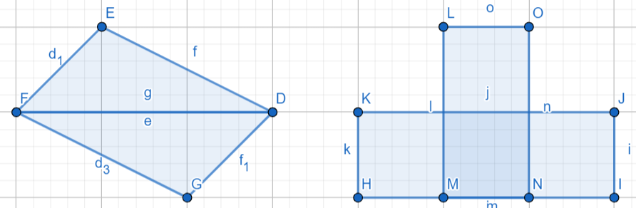

# Pattern Oriented Software Design 2022 Fall Assignment

## Assignment 2
#### Deadline: 10/10 Tue. 23:59

### Introduction

In this assignment, you are required to implement `Composite pattern` and `Iterator pattern` with TDD. The deadline is at 23:59, 10/10(Mon.).

### Problem statement

We have implemented various shapes such as `Triangle`, `Rectangle`, and `Circle`. Now we have a new type of shape called `CompoundShape`, which is composed of multiple shapes. For example, two upside-down triangles of the same angles and length can compose a composed shape that looks like a parallelogram or a rectangle, or several rectangles can compose the compound shapes that look like tetrominoes in Tetris. A compound shape can be composed of other compound shapes to make a more complicated shape. To carry out this idea, we need to implement `Composite pattern` with shapes.



For a compound shape, we would like to traverse its tree structure. Since we implement `Composite pattern`, the internal structure of the compound shape will be a nested tree-like structure. Instead of having a getter method from the compound shape interface, we adopt `Iterator pattern`. By iterator, we can traverse the shapes in a compound shape in different ways, such as [BFS](https://www.wikiwand.com/en/Breadth-first_search) or [DFS](https://www.wikiwand.com/en/Depth-first_search), without knowing its internal structure.

This assignment asks you to implement adding and deleting a shape to/from a compound shape. It also asks you to implement and test various iterators and traversal strategies including BFS and DFS.

### File structure

The file structure is as followed. The project has two parts: `src` and `test`. All unit tests should be implemented in `test` folder and all classes should be implemented in `src`. **Please follow our interface, file structure, and file name** because we will test your code with our test data. Although we will not modify your source code and just replace the test files, any compilation errors due to non-compliant change could fail the assignment.
```diff
 .
 ├── bin
 │   └── ut_all
 ├── src
+│   ├── iterator
+│   │   ├──bfs_compound_iterator.h
+│   │   ├──dfs_compound_iterator.h
+│   │   ├──iterator.h
+│   │   └──null_iterator.h
 │   ├── circle.h
+│   ├── compound_shape.h
 │   ├── point.h
 │   ├── rectangle.h
 │   ├── shape.h
 │   ├── triangle.h
 │   └── two_dimensional_vector.h
 ├── test
+│   ├── iterator
+│   │   ├──ut_bfs_compound_iterator.h
+│   │   ├──ut_dfs_compound_iterator.h
+│   │   └──ut_null_iterator.h
 │   ├── ut_circle.h
+│   ├── ut_compound_shape.h
 │   ├── ut_main.cpp
 │   ├── ut_point.h
 │   ├── ut_rectangle.h
 │   ├── ut_triangle.h
 │   └── ut_two_dimensional_vector.h
 └── makefile
```

### Implementation

<span style="color:red">This section describes all implementation conditions that you should abide by. Please read them carefully.</span>.

`CompoundShape`: a class that can be composed of multiple shapes, including other compound shapes. When initializing a `CompoundShape`, we give it a list of shapes and we do not care whether these shapes are close to each other or not. If two shapes are far apart, they can be composed as well.

A compound shape is also a `Shape`, meaning that this class should inherit `Shape` class and implement the methods (`area`, `perimeter`, and `info`). To make life easier, the area and perimeter of a compound shape is the sum of the shapes it contains. It does not matter whether shapes overlap or not. The `info` of a compound should follow the format:
```c++
std::list<Shape*> shapes = {
    new Circle(
        new TwoDimensionalVector(
            Point(1.3449, -1.999),
            Point(6.0, 7)
        )
    ),
    new Rectangle(
        new TwoDimensionalVector(
            Point(-3, 3), Point(-1, 3)
        ),
        new TwoDimensionalVector(
            Point(-1, 3), Point(-1, -1)
        )
    )
};
(new CompoundShape(&shapes))->info();
> "CompoundShape (Circle (Vector ((1.34, -2.00), (6.00, 7.00))), Rectangle (Vector ((-3.00, 3.00), (-1.00, 3.00)), Vector ((-1.00, 3.00), (-1.00, -1.00))))"
```

`CompoundShape` is also a flexible shape. It can be added more shapes or can remove some shapes after it is initialized, corresponding to `addShape` and `deleteShape` methods respectively. When adding a shape into a compound shape that has other compound shapes, we just add it to the current compound shape directly (attach this shape to the tail of the list). We don't specify which position the shape should be placed in. On the other hand, when deleting a shape from a compound shape, *we delete its instance*. Be careful when you implement `deleteShape`, the target shape should be removed even if it is at a deep position in the tree structure.

`Iterator`: a class declaring methods for traveling the internal structure of `CompoundShape`. By subclassing `Iterator`, we can implement different traveling strategies. An iterator is created by the object that the iterator is going to traverse to, so it is able to track the shapes in a compound shape.

The usage of iterator:
```c++
Iterator *it = compoundShape->createDFSIterator();
for(it->first(); it->isDone(); it->next()) {
    Shape *shape = it->current();
    // ...
}
```
The `first` method is used to initialize the iterator state. It can be called either on the for loop initialization or in the iterator constructor. The `isDone` is to check if the iterator has gone through all elements (shapes). The `next` tells the iterator to move to the next element. The `current` returns the current element that the iterator steps on.

Notice that an iterator can know it has gone through all elements only after the last `next` is called. For example, there is a compound shape contains two shapes: a triangle and a rectangle. The order of iterator methods and the expected output should be as below:
```c++
// compoundShape contains two shapes: a triangle and a rectangle.
Iterator *it = compoundShape->createDFSIterator();
it->first();   // no return
it->isDone();  // false
it->current(); // the triangle
it->next();    // no return

it->isDone();  // false
it->current(); // the rectangle
it->current(); // still the rectangle
it->isDone();  // false!
it->next();    // no return (the last call on `next`)

it->current(); // an exception threw
it->isDone();  // true!
it->next();    // an exception threw
```

As we mentioned above, we can implement different iterators for different traveling strategies. In this assignment, we need to build three kinds of iterator: `DFSIterator`, `BFSIterator`, and `NullIterator`.

`DFSIterator` and `BFSIterator` are created by `CompoundShape`. As their names, one is for [Depth-First Search](https://www.wikiwand.com/en/Depth-first_search), another is for [Breadth-First Search](https://www.wikiwand.com/en/Breadth-first_search). Taking `DFSIterator` as an example, if we have a compound shape having a structure like:
```
     C1
    /   \
  C2    C3
  /   /  |  \
Tri Rect Cir1 Cir2
```
The DFS order of the DFS iterator from C1 should be:
*C2, Tri, C3, Rect, Cir1, and then Cir2*. **Note that the iterator does not return the shape that creates it.** In this example, C2 and C3 are returned by C1's iterator but not by own iterators.

For the same case, the BFS order should be: *C2, C3, Tri, Rect, Cir1, and Cir2*.

`NullIterator` is created by *leaves*, i.e., `Triangle`, `Rectangle`, and `Circle`. This iterator is used for boundary cases. When we traverse the tree in a compound shape, this iterator can be helpful for us to check if the current shape is a *Leaf*, where no more shapes are at the next level. A null iterator does not return any shapes. It is empty. Its `isDone` always returns true without calling `next`; `next` and `current` throw an exception once get called.

Since `DFSIterator`, `BFSIterator`, and `NullIterator` inherit from the `Iterator` class, we can treat them *uniformly*, which let us easier to deal with iterators from different kinds of shapes.


- **Each class method declared in header files must be implemented and have at least one test case.**
- For all classes above, an exception should raise if we give any illegal input to the constructor. The exception type is not specified, which can be as simple as `string`.
- If the type of returned value is `double`, your assertion should compare the value with the error not greater than `0.001`.
- All `double` values should be rounded to two decimal place and be padded with 0 when turned into `string`, e.g., `-1.999` will be `"-2.00"`.
- You can use `M_PI` in `cmath` for calculation of π.
- You can use [GeoGebra](https://www.geogebra.org/calculator) to design your test data.

### Submission

Please use the [workspace](http://140.124.181.100/course/environment_setting) you have setup in assignment 1. If the setting is correct, whenever you push your code to the repository, the repository will trigger a test job titled `posd2022f_<student_id>_HW` from [the CI server](http://140.124.181.97:8080/). You can check whether your unit tests pass from the test job. Once all tests pass, another test job will be trigger, `posd2022f_<student_id>_HW_TA`. In this job, your code will be tested with our test data. You can also check whether your code pass all tests we made. Make sure all tests pass before the deadline.

### Grading Rubrics

- Unit tests written by yourself: 50%.
- Unit tests written by TA: 50%.

### You Will Get 0 Points If

- your test still cannot be executed after the deadline; for example, your code fails to compile or a unit test breaks due to a runtime exception;
- you unit tests pass in an unreasonable way; for example, all tests use `ASSERT_TRUE(true)`;
- your code is copied from another student's assignment.


### Notes

- For unit testing, consider as many cases as possible.
- Discussion is encouraged but the code must be your own.
- Feel free to contact us if you have any suggestions or concerns.

### References

- [POSD2022F course link](http://140.124.181.100/yccheng/posd2022f)
- [Environment setting](http://140.124.181.100/course/environment_setting)
- [Makefile tutorial](http://140.124.181.100/course/makefile_tutorial)
- [C++.com](http://www.cplusplus.com/reference/)
- [C++ exception handling](https://www.tutorialspoint.com/cplusplus/cpp_exceptions_handling.htm)
- [Vector introduction](https://mathinsight.org/cross_product_formula)
- [Magnitude(length) of a vector](https://mathinsight.org/definition/magnitude_vector)
- [Dot product formula](https://mathinsight.org/dot_product_formula_components)
- [Cross product formula](https://mathinsight.org/cross_product_formula)
- [GeoGebra](https://www.geogebra.org/calculator)
- [Depth-First Search](https://www.wikiwand.com/en/Depth-first_search)
- [Breadth-First Search](https://www.wikiwand.com/en/Breadth-first_search)

### TA Contact

    Name: James Jhang, Paul Lai
    Email: e8315402, xie57813 (gmail)
    Office room: 宏裕科技大樓 13F 1321(後門)
    Office hours: 10am - 12pm , Tue/Wed