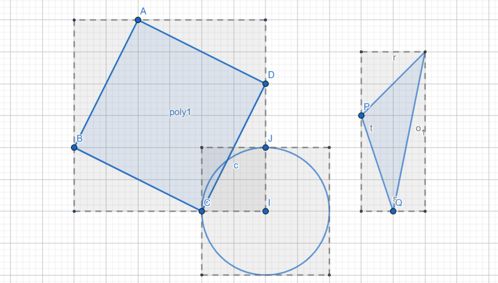

# Pattern Oriented Software Design 2022 Fall Assignment

## Assignment 3

#### Deadline: 10/24 Tue. 23:59

### Introduction

In this assignment, you are required to implement a simple algorithm of collision detection by using the `Visitor` and `Abstract Factory` patterns. The deadline is at 23:59, 10/24(Mon.).

### Problem statement

Collision detection is an important issue for many field such as game engine or physics simulation. There are many algorithms can be used in either 2D or 3D space. A simple way to implement collision detection in 2D is called **Axis-aligned minimum bounding box (AABB)**. AABB is an rectangle enclosing the objects that should be detected. By comparing the coordinates of AABBs, we can easily know which objects have collided.



As shown above, the AABB of a shape surrounds the shape itself and is not rotated no matter what a shape look like. An AABB is made by two coordinates, the upper right and the lower left ones. The x and y of the upper right coordinate are the the maximum x/y of all vertices of the shape; the lower left, the minimum. For `CompoundShape`, its AABB encloses all AABBs it contains.

This assignment asks you to identify the shapes that collide with a target shape. The shapes are grouped in a tree structure using `CompoundShape`, which is also called *AABB-tree*, and the target shape is put into the tree to do the collision detection. Taking the advantage of the tree structure, the target shape should be compared with the shapes in tree layer by layer. The shape only goes through the branches that have collided with it, meaning that if a compound shape does not collide with it, it will not compare with the shapes in that compound shape.

We will implement the process described above by using the `Visitor` and `Abstract Factory` patterns. The detection process is implemented in a visitor called `CollisionDetector`, in which each shape will be *visited* to produce their corresponding AABBs and to compare with the AABB of the shape put in. The collided shapes will be stored in a list in the visitor. We implement the detection process in `Visitor` not in `Shape` because collision detection does not belong to the nature of shape. In addition, to traverse the AABB tree, we need to implement a new iterator: *ListCompoundIterator*, which only returns the child shapes of a compound shape but not the grandchild shapes. We will use the `Abstract Factory` pattern to bring this new iterator on `Shape` along with other existing iterators.

This assignment asks you to implement the `Visitor` pattern to carry out the detection process and the `Abstract Factory` pattern to bring in a new iterator that only returns the child shapes of a compound shape.

### File structure

The file structure is as followed. The project has two parts: `src` and `test`. All unit tests should be implemented in `test` folder and all classes should be implemented in `src`. **Please follow our interface, file structure, and file name** because we will test your code with our test data. Although we will not modify your source code and just replace the test files, any compilation errors due to non-compliant change could fail the assignment.
```diff
 .
 ├── bin
 │   └── ut_all
 ├── src
 │   ├── iterator
+|   |   ├── factory
+|   |   |   ├── iterator_factory.h
+|   |   |   ├── bfs_iterator_factory.h
+|   |   |   ├── bfs_iterator_factory.cpp
+|   |   |   ├── dfs_iterator_factory.h
+|   |   |   ├── dfs_iterator_factory.cpp
+|   |   |   └── list_iterator_factory.h
 │   │   ├── bfs_compound_iterator.h
 │   │   ├── dfs_compound_iterator.h
+|   |   ├── list_compound_iterator.h
 │   │   ├── iterator.h
 │   │   └── null_iterator.h
+│   ├── visitor
+│   │   ├── shape_visitor.h
+│   │   └── collision_detector.h
+│   ├── bounding_box.h
 │   ├── circle.h
 │   ├── compound_shape.h
 │   ├── point.h
 │   ├── rectangle.h
 │   ├── shape.h
 │   ├── triangle.h
 │   └── two_dimensional_vector.h
 ├── test
 │   ├── iterator
 │   │   ├── ut_bfs_compound_iterator.h
 │   │   ├── ut_dfs_compound_iterator.h
 │   │   └── ut_null_iterator.h
+│   ├── visitor
+│   │   └── ut_collision_detector.h
+│   ├── ut_bounding_box.h
 │   ├── ut_circle.h
 │   ├── ut_compound_shape.h
 │   ├── ut_main.cpp
 │   ├── ut_point.h
 │   ├── ut_rectangle.h
 │   ├── ut_triangle.h
 │   └── ut_two_dimensional_vector.h
 └── makefile
```

### Implementation

**This section describes all implementation conditions that you should abide by. Please read them carefully.**

`Shape`: There are three changes on `Shape` class:

1. A new method: `accept` is added. The `accept` method takes a `ShapeVisitor` as an argument. Each subclass of `Shape` overrides this method to call the visitor operations corresponding to the subclass.
For example, in `Circle`, the `accept` calls `visitCircle` from the visitor, in `Rectangle`, it calls `visitRectangle`, and so on.

2. Another new method: `getPoints` is added, which returns all vertices of the shape. This method is used to produce the AABB, because the AABB needs the vertices of the shape to calculate the maximum and minimum coordinates.
    * For `Triangle`, the method overriding just returns all vertices the triangle has.
    * For `Rectangle`, since a rectangle has only three vertices at the beginning, the method overriding should calculate the fourth vertex before returning all vertices. [To get the fourth vertex](https://stackoverflow.com/a/53392548), given two vertical vectors v1(A, B) and v2(B, C), the fourth vertex D will be A + C - B, regardless of the rotation of rectangle.
    * For `Circle`, since a circle only has the center, the method overriding should directly calculate and return the upper right and lower left coordinates of the AABB of the circle.
    * For `CompoundShape`, the method overriding returns all vertices of all shapes that the compound shape contains.

3. `createDFSIterator` and `createBFSIterator` are replaced with `createIterator`. The `createIterator` method takes a `IteratorFactory` as an argument. The shape calls the `createIterator` of `IteratorFactory` to create an iterator. Shapes now have no way of knowing which iterator is going to be created. This depends on how the client wants to traverse the shapes. By using the `IteratorFactory` interface, if there is a new iterator in the future, the `Shape` class won't be modified again.

`ShapeVisitor`: a class representing the visitor that can be applied to the `Shape` family. This class declares *visit* methods for all shapes. Each method corresponds to a shape type, such as `visitCircle` or `visitCompoundShape`. These methods take the corresponding shape class as their argument, in order to access the shape to perform the task of visitor.

`CollisionDetector`: a class inherited from `ShapeVisitor`. This visitor implements the collision detection algorithm with AABB. When initialized, it takes and stores a shape that needs to be detected. To start the detection, it should be accepted by a compound shape, which is the tree root.

```c++
Shape *dart = new Triangle(...); // the target shape
Shape *bullseyes = new CompoundShape(...); // the shapes composed of a tree structure
CollisionDetector visitor = new CollisionDetector(dart);
bullseyes->accept(visitor);
std::list<Shape *> scores = visitor->collidedShapes();
```

In the visitor, there are four methods: `visitCircle`, `visitTriangle`, `visitRectangle`, and `visitCompoundShape`. When `visitCircle`, `visitTriangle`, and `visitRectangle` get called from the shapes, the visitor produces the corresponding AABB by invoking `getPoints` on the calling shape. Then it compares whether the produced AABB collides with the AABB of the shape put in. If they collide, the visitor store the calling shape in a list. When `visitCompoundShape` gets called, the visitor also produces the AABB of the compound shape and compares with the AABB of the shape put in. If they collides, the visitor *do not store* this compound shape; instead, it creates a `ListCompoundIterator` for the compound shape and let the child shapes accept the visitor itself. Therefore, the visitor can keep comparing the shapes in the compound shape collided. After the whole process finishes, The client can call `collidedShapes` to get the result.

`BoundingBox`: a class representing the axis-aligned minimum bounding box(AABB). When initialized, it takes a set of coordinates(points) as an argument to calculate the maximum and minimum coordinates. At least one coordinate is required; an exception should otherwise be threw.

To check whether two bounding boxes collide, we can first think in reverse—what are the conditions for two boxes *NOT* to collide? Here are the conditions:
1. the X_max of the box1 is smaller than the X_min of the box2; or
2. the X_min of the box1 is greater than the X_max of the box2; or
3. the Y_max of the box1 is smaller than the Y_min of the box2; or
4. the Y_min of the box1 is greater than the Y_max of the box2.

So, if *non* of these conditions is met, we can say two boxes collide. You can use other conditions. Just make sure the result is correct.

The `BoundingBox` does not inherit from `Shape`, even it looks like a rectangle, because we say the collision detection does not belong to the nature of shape. We do not want to mount any stuff related to collision detection on the `Shape` family.

`IteratorFactory`: a class declaring methods for creating `Iterator`. It has two methods, one has no arguments and another has. This is because we have two types of iterator: the iterator for *Leaf*, which is `NullIterator`, and the iterators for *Composite*, which are `DFS/BFSCompoundIterator` and `ListCompoundIterator`. The iterator for *Leaf* does not need any arguments, but the ones for *Composite* need. Therefore, the *Leaf* calls the creating method without argument to create `NullIterator`, and the *Composite* calls the creating method with arguments to create `DFS/BFSCompoundIterator` or `ListCompoundIterator`.

```c++
Shape *cir = new Circle(...);
Iterator *cit1 = cir->createIterator(new DFSIteratorFactory());
// cit1 is a NullIterator.
Iterator *cit2 = cir->createIterator(new BFSIteratorFactory());
// cit2 is also a NullIterator.

Shape *cs = new CompoundShape(...);
Iterator *csit1 = cs->createIterator(new DFSIteratorFactory());
// csit1 is a DFSCompoundIterator.
Iterator *csit2 = cs->createIterator(new BFSIteratorFactory());
// csit2 is a BFSCompoundIterator.
```

Note that `DFSCompoundIterator` calls `DFSIteratorFactory` to create an iterator for the next level, and `DFSIteratorFactory` also calls the `DFSCompoundIterator` constructor. There is a circular dependency. We need to separate the factory into the header and cpp files, just like we did on the class. The same goes for `BFSCompoundIterator` and `BFSIteratorFactory`.

`ListCompoundIterator`: a class inherited from `Iterator`. This iterator only traverses the child shapes of a compound shape. Taking the tree below as an example, if we create a list iterator from C1, we can only get C2 and C3 from the iterator.
```
     C1
    /   \
  C2    C3
  /   /  |  \
Tri Rect Cir1 Cir2
```

- **Each class method declared in header files must be implemented and have at least one test case.**
- **For `createIterator` and `IteratorFactory`, we can reuse the tests for `createDFSIterator` and `createBFSIterator` before, so no additional tests are required. Other than that, the rest of new methods should have at least one test cases.**
- For all classes above, an exception should raise if we give any illegal input to the constructor. The exception type is not specified, which can be as simple as `string`.
- If the type of returned value is `double`, your assertion should compare the value with the error not greater than `0.001`.
- All `double` values should be rounded to two decimal place and be padded with 0 when turned into `string`, e.g., `-1.999` will be `"-2.00"`.
- You can use `M_PI` in `cmath` for calculation of π.
- You can use [GeoGebra](https://www.geogebra.org/calculator) to design your test data.

### Submission

Please use the [workspace](http://140.124.181.100/course/environment_setting) you have setup in assignment 1. If the setting is correct, whenever you push your code to the repository, the repository will trigger a test job titled `posd2022f_<student_id>_HW` from [the CI server](http://140.124.181.97:8080/). You can check whether your unit tests pass from the test job. Once all tests pass, another test job will be trigger, `posd2022f_<student_id>_HW_TA`. In this job, your code will be tested with our test data. You can also check whether your code pass all tests we made. Make sure all tests pass before the deadline.

### Grading Rubrics

- Unit tests written by yourself: 50%.
- Unit tests written by TA: 50%.

### You Will Get 0 Points If

- your test still cannot be executed after the deadline; for example, your code fails to compile or a unit test breaks due to a runtime exception;
- you unit tests pass in an unreasonable way; for example, all tests use `ASSERT_TRUE(true)`;
- your code is copied from another student's assignment.


### Notes

- For unit testing, consider as many cases as possible.
- Discussion is encouraged but the code must be your own.
- Feel free to contact us if you have any suggestions or concerns.

### References

- [POSD2022F course link](http://140.124.181.100/yccheng/posd2022f)
- [Environment setting](http://140.124.181.100/course/environment_setting)
- [Makefile tutorial](http://140.124.181.100/course/makefile_tutorial)
- [C++.com](http://www.cplusplus.com/reference/)
- [C++ exception handling](https://www.tutorialspoint.com/cplusplus/cpp_exceptions_handling.htm)
- [Vector introduction](https://mathinsight.org/cross_product_formula)
- [Magnitude(length) of a vector](https://mathinsight.org/definition/magnitude_vector)
- [Dot product formula](https://mathinsight.org/dot_product_formula_components)
- [Cross product formula](https://mathinsight.org/cross_product_formula)
- [GeoGebra](https://www.geogebra.org/calculator)
- [Depth-First Search](https://www.wikiwand.com/en/Depth-first_search)
- [Breadth-First Search](https://www.wikiwand.com/en/Breadth-first_search)

### TA Contact

    Name: James Jhang, Paul Lai
    Email: e8315402, xie57813 (gmail)
    Office room: 宏裕科技大樓 13F 1321(後門)
    Office hours: 10am - 12pm , Tue/Wed