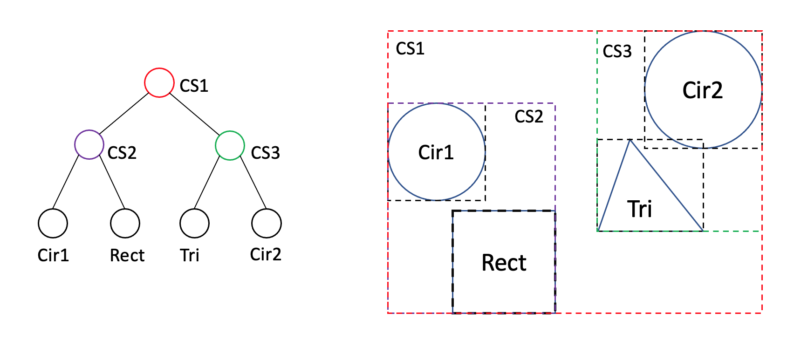
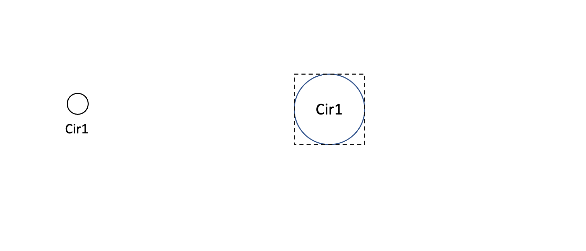
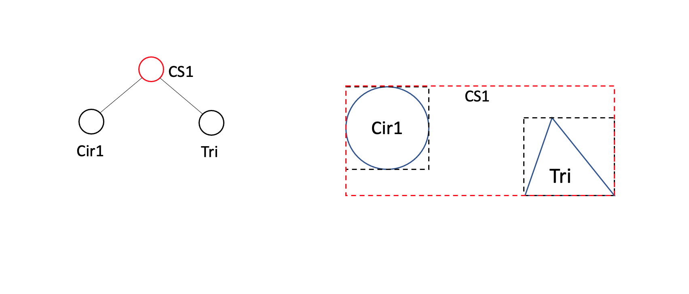
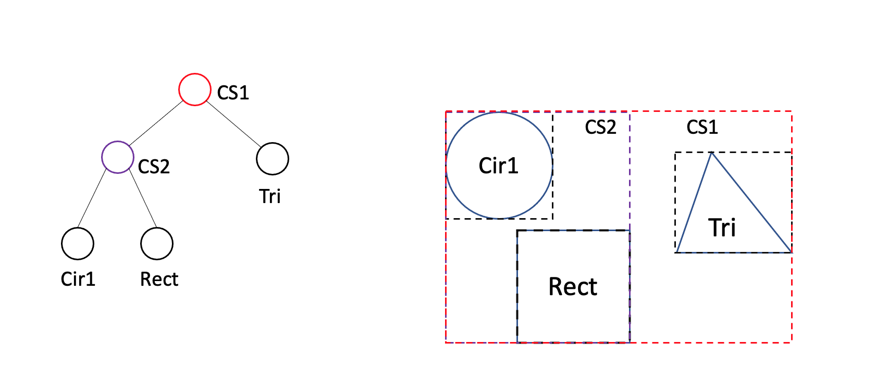
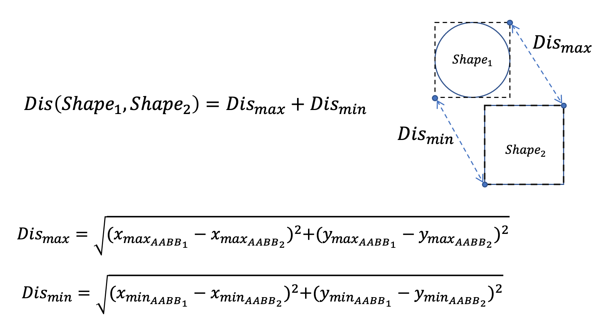
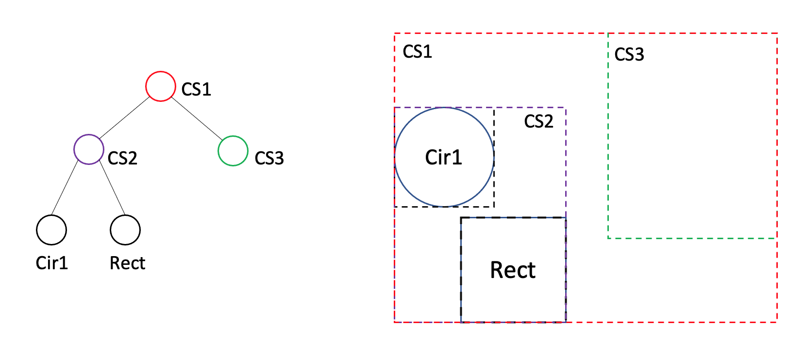
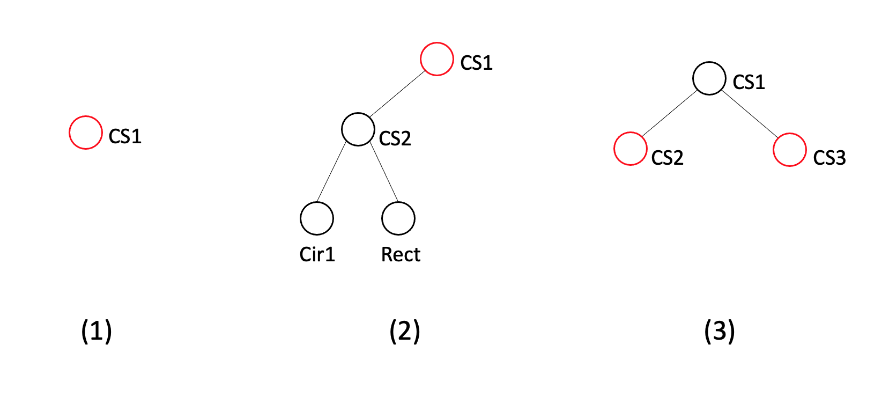

# Pattern Oriented Software Design 2022 Midterm Exam

### Deadline: 11/07 Mon. 16:00

## Introduction

In this exam, you are asked to implement a `Builder` to construct an AABB tree and to implement an `Iterator` to return shapes that are illegal against the tree rule. You will also need to implement two new `Visitors` and to modify `CompoundShape` and `BoundingBox` for the new builder and iterator.

**The submission process of the exam is exactly the same as the one of assignments, pushing your code onto your GitLab repository and checking whether they pass with your tests and TA's tests on the CI server. The deadline is at 16:00, 11/07 (Mon.).**

## Problem statement

In assignment 3 we have implemented a simple algorithm for collision detection using **Axis-aligned minimum bounding box (AABB)**. We can easily check whether two shapes have collided by comparing their AABBs. In the case of a number of shapes, we can first compose the shapes to a tree structure by using compound shapes and then identify which shapes collide with the target shape in the BFS order. However, we have not yet known how to **correctly** compose a tree, an AABB tree. In the following, we will know how to compose an AABB tree and know what tree is an legal tree and what is not.

### Building an AABB tree

AABB tree is a binary tree. Each node is a compound shape that contains at most two children, either compound shapes or *Leaf* shapes (triangle, rectangle, or circle). The diagram below is a legal example of an AABB tree. Looking at the left side of the diagram, the root node, CS1, is a compound shape containing two compound shapes, CS2 and CS3. CS2 contains two shapes, a circle(Cir1) and a rectangle(Rect), and CS3 also contains two shapes, another circle(Cir2) and a triangle(Tri). The right side of the diagram is the shapes of the tree, surrounding by their AABBs (the dotted boxes).



**An AABB tree should be built by putting shapes into the tree one by one. Each time we put a new shape into the tree, we need to find out the closest shape to the shape we put and to create a new compound shape to compose these two shapes to be a new branch.** Through the four diagrams below, we can clearly understand this process.

At the beginning, we only have one Leaf shape, for example, a circle (Cir).



Then, we have another shape, a triangle (Tri). We put the triangle into the tree. These two shapes will be composed under a compound shape (CS1).



Now, we have one more shape that is needed to be added, a rectangle (Rect). When putting the rectangle into the tree, we need to know **which shape in the tree is the closest shape** to the rectangle. In this example, the circle (Cir) is the closest shape. Next, we create a new compound shape (CS2) and put these two shapes (the circle and the rectangle) under this newly created compound shape (CS2). We then replace the original position of the circle with this new compound shape. The tree should be like the diagram below.



To determine whether two shapes are close or not, we need to know their distance. The diagram below shows the formula of the distance of two shapes, which is easy. We just calculate the distances of the maximum and minimum points of their AABBs and sum the distances.



Finally, if we put another circle (Cir2) into the tree, and we know the closest shape to the circle is the triangle (Tri), we repeat the process described above: creating a new compound shape (CS3), putting the circle (Cir2) and the triangle (Tri) under the compound shape (CS3), and replacing the position of the triangle (Tri) with the new compound shape (CS3). The final tree should be:


In this exam, to build an AABB tree, we are going to implement a `Builder` named `AABBTreeBuilder` and a `Visitor` named `ClosestShapeFinder`. The `AABBTreeBuilder` is responsible for creating shapes and inserting them into the tree one by one. It will call `ClosestShapeFinder` to find out the closest shape to the shape inserted. When the builder gets the closest shape, it determines whether the shape can be directly inserted or a new compound shape should be created. The `ClosestShapeFinder` is for finding the closest shape; however, a more important task for this finder is that the parent shape of the closest shape should be saved as well. Otherwise, the `AABBTreeBuilder` is not able to do the replacement.

### Legal and illegal trees

Sometimes, we decide to delete some shapes from the tree, but we could break the tree. We need to know whether the tree becomes illegal after deleting.

Taking the tree above as an example, if we delete the Tri and Cir2 from the CS3, the tree will be like the diagram below. In this case, the CS3 becomes an illegal node, which contains no children and should be removed in the future. This tree becomes an illegal tree.



We say a node is illegal if
1. it is a compound shape and does not have any children, or
2. it is a compound shape and has only one child that is also a compound shape.

Below we list three illegal cases. In the first case, CS1 is an illegal node because it does not have any children; in the second case, CS1 is still the illegal node because it has only one child that is a compound shape; in the third case, the illegal nodes are CS2 and CS3 because they do not have any children.


All other cases are considered legal.

In this exam, we are going to implement an `Iterator` named `IllegalNodeIterator` and a `Visitor` named `IllegalNodeChecker`. The `IllegalNodeIterator` should return all illegal nodes in an AABB tree. For the first and second cases above, the iterator should only return CS1; for the third case, it should return CS2 and CS3. The iterator calls the `IllegalNodeChecker` to check whether a shape violates any tree rules.

## File structure

The file structure is as followed. The project has two parts: `src` and `test`. All unit tests should be implemented in `test` folder and all classes should be implemented in `src`. **Please follow our interface, file structure, and file name** because we will test your code with our test data. Although we will not modify your source code and just replace the test files, any compilation errors due to non-compliant change could fail the exam.
```diff
 .
 ├── bin
 │   └── ut_all
 ├── src
+│   ├── builder
+│   │   └── aabb_tree_builder.h
 │   ├── iterator
 │   │   ├── factory
 │   │   │   ├── iterator_factory.h
 │   │   │   ├── bfs_iterator_factory.h
 │   │   │   ├── bfs_iterator_factory.cpp
 │   │   │   ├── dfs_iterator_factory.h
 │   │   │   ├── dfs_iterator_factory.cpp
+│   │   │   ├── illegal_node_iterator_factory.h
 │   │   │   └── list_iterator_factory.h
 │   │   ├── bfs_compound_iterator.h
 │   │   ├── dfs_compound_iterator.h
 │   │   ├── list_compound_iterator.h
+│   │   ├── illegal_node_iterator.h
 │   │   ├── iterator.h
 │   │   └── null_iterator.h
 │   ├── visitor
 │   │   ├── shape_visitor.h
+│   │   ├── closest_shape_finder.h
+│   │   ├── illegal_node_checker.h
 │   │   └── collision_detector.h
 │   ├── bounding_box.h
 │   ├── circle.h
 │   ├── compound_shape.h
 │   ├── point.h
 │   ├── rectangle.h
 │   ├── shape.h
 │   ├── triangle.h
 │   └── two_dimensional_vector.h
 ├── test
+│   ├── builder
+│   │   ├── ut_aabb_tree_builder.h
 │   ├── iterator
 │   │   ├── ut_bfs_compound_iterator.h
 │   │   ├── ut_dfs_compound_iterator.h
+│   │   ├── ut_illegal_node_iterator.h
 │   │   ├── ut_list_compound_iterator.h
 │   │   └── ut_null_iterator.h
 │   ├── visitor
+│   │   ├── ut_closest_shape_finder.h
+│   │   ├── ut_illegal_node_checker.h
 │   │   └── ut_collision_detector.h
 │   ├── ut_bounding_box.h
 │   ├── ut_circle.h
 │   ├── ut_compound_shape.h
 │   ├── ut_main.cpp
 │   ├── ut_point.h
 │   ├── ut_rectangle.h
 │   ├── ut_triangle.h
 │   └── ut_two_dimensional_vector.h
 └── makefile
```

## Implementation

**This section describes all implementation conditions that you should abide by. Please read them carefully.**

`CompoundShape`: There is a new method: `replace` on the `CompoundShape` class. It takes two shapes as arguments, `old_shape`, a shape that is replaced and `new_shape`, a shape that is to replace. This method only replace the shape under the current compound shape. In other words, we do NOT need to look at the deeper levels like `deleteShape`.

`BoundingBox`: There is a new method: `distance` on the `BoundingBox` class. It takes another bounding box as an arguments. The method returns the distance in double by the formula presented on the *Problem statement* section.

`AABBTreeBuilder`: a class to build an AABB tree. It has three methods to insert shapes, `insertTriangle`, `insertCircle`, and `insertRectangle`, and one method to return the tree root, `getTree`. Unlike the classes we implemented before, we do not need to create shapes by ourself; instead, we give it `Points`. For example, when calling `insertCircle`, we give it two points representing the head and tail of the vector that a circle requires.
```c++
AABBTreeBuilder builder();
builder.insertCircle(
  new Point(0, 0), new Point(0, 3)
);
Shape *root = builder.getTree(); // root is the circle.
```
For `insertTriangle` and `insertRectangle`, we give them three points. One is the common point representing the connected point of the two vectors, one is the head or tail point of the first vector, and the other is the head or tail point of the second vector.

Whenever the `insertXXX` method is called, the builder creates the corresponding shape. Then it calls `ClosestShapeFinder` with the root shape to get the closest shape and its parent shape. The builder checks whether the created shape can be directly added into the parent shape. If it is not, the builder should first create another compound shape to compose the closest shape and the created shape and then do the replacement as we mentioned on the *Problem statement* section.
```c++
AABBTreeBuilder builder();
builder.insertCircle(
  new Point(0, 0), new Point(0, 3)
);
builder.insertTriangle(
  new Point(1.5, 1.7), new Point(6, 3.2), new Point(1, 4.8)
);
Shape *root = builder.getTree();
// The root is a compound shape, and the AABB tree should be:
//       CS
//     /   \
//   Cir   Tri
```

`ClosestShapeFinder`: a visitor used to find the closest shape to the target shape in an AABB tree. The `ClosestShapeFinder` class inherits from the `ShapeVisitor` class. This visitor is so similar to the `CollisionDetector` so we can refer to the `CollisionDetector` to implement. The `getClosestShape` returns the closest shape, and the `getParent` returns the parent shape of the closest shape.

`IllegalNodeIterator`: an iterator that only returns illegal shapes against the tree rule. The `IllegalNodeIterator` class inherits from the `Iterator` class. It calls `IllegalNodeCheck` to check whether the shape it walks on is illegal or not. Like other iterators, this iterator also has a corresponding factory called `IllegalNodeIteratorFactory`, which creates the `IllegalNodeIterator` from `Shape` if needs.

`IllegalNodeCheck`: a visitor used to store the tree rules and check whether the shape violates. Note that this visitor is really simple. It do not need to traversal the tree but solely stores the checking result of a shape. The caller can use `isIllegal` to get the result.

`IllegalNodeIteratorFactory`: a factory used to create an `IllegalNodeIterator`. Pay attention to its interface, which accepts a shape as an argument. This is because we need to handle some corner cases, such as an AABB tree having only one node that is a compound shape.
```c++
builder.insertCircle(...);
builder.insertRectangle(...);
builder.insertTriangle(...);
Shape *root = builder.getRoot();
//       CS1
//      /   \
//    Cir   CS2
//         /   \
//       Rect  Tri
Shape *cir = root->createIterator(new ListIteratorFactory())->currentItem();
root->deleteShape(cir);

Iterator *illegalIt = root->createIterator(new IllegalNodeIteratorFactory(root));
illegalIt->currentItem(); // CS1
illegalIt->next();
illegalIt->isDone(); // true
```

- **Each class method declared in header files must be implemented and have at least one test case.**
- **For `IllegalNodeIteratorFactory`, we can reuse the tests for `IllegalNodeIterator`, so no additional tests are required. Other than that, the rest of new methods should have at least one test case.**
- For all classes above, an exception should raise if we give any illegal input to the constructor. The exception type is not specified, which can be as simple as `string`.
- If the type of returned value is `double`, your assertion should compare the value with the error not greater than `0.001`.
- All `double` values should be rounded to two decimal place and be padded with 0 when turned into `string`, e.g., `-1.999` will be `"-2.00"`.
- You can use `M_PI` in `cmath` for calculation of π.

### Submission

Please use the [workspace](http://140.124.181.100/course/environment_setting) you have setup in the assignments. If the setting is correct, whenever you push your code to the repository, the repository will trigger a test job titled `posd2022f_<student_id>_HW` from [the CI server](http://140.124.181.97:8080/). You can check whether your unit tests pass from the test job. Once all tests pass, another test job will be trigger, `posd2022f_<student_id>_HW_TA`. In this job, your code will be tested with our test data. You can also check whether your code pass all tests we made. Make sure all tests pass before the deadline.

### Grading Rubrics

- Unit tests written by yourself: 50%.
- Unit tests written by TA: 50%.

### You Will Get 0 Points If

- your test still cannot be executed after the deadline; for example, your code fails to compile or a unit test breaks due to a runtime exception;
- you unit tests pass in an unreasonable way; for example, all tests use `ASSERT_TRUE(true)`;
- your code is copied from another student's repository.


### Notes

- For unit testing, consider as many cases as possible.
- Feel free to ask us if you have any questions about the exam.

### References

- [POSD2022F course link](http://140.124.181.100/yccheng/posd2022f)
- [C++.com](http://www.cplusplus.com/reference/)
- You code on GitLab
