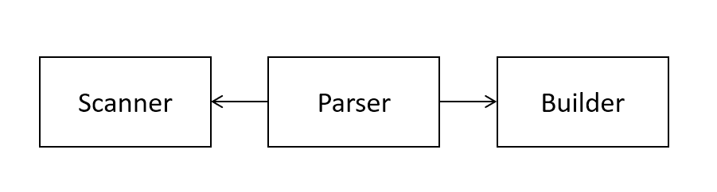

# Pattern Oriented Software Design 2022 Fall Assignment

## Assignment 4

#### Deadline: 11/28 Mon. 23:59

## Introduction

In this assignment, you are required to
1. implement a `Parser` with a `Scanner` and a `Builder` and
2. apply the `Singleton` pattern on the `IteratorFactory` family.

The deadline is at 23:59, 11/28(Mon.).

## Problem statement

### 1. Parser, Scanner, and Builder

A parser is a component used to analyze a string of symbols for a language, which is a necessary phase in compiling. Usually, a parser produces a parse tree containing symbols as nodes; in our course, the parser is to convert a string into the corresponding instances of shape.

The parser accepts a string input. The input represents a tree structure of the **shapes** that are going to be created. Below is an example with a vaild input. The input represents a circle created by a two-dimensional vector. After the parser parses this input, a corresponding circle instance should be created.
```c++
std::string input = "Circle (Vector ((-4.28, 0.26), (-4.83, 0.73)))";
Parser parser(input);
parser.parse();
std::vector<Shape*> result = parser.getResult();
// The first shape in the result should be a circle with (-4.28, 0.26) as the center.
```

In the parser, there are two components that help the parser to create shapes: a scanner and a builder. As the model diagram shows below, the parser uses there two components to parse the input and to create the shapes.
<div align="center">
  
</div>

The scanner is responsible for extracting **tokens** from the input. Tokens are the string that are meaningful to our application, the parser. Taking the input above as the example, `"Circle"` is a token because it represents the `Circle` class. `"Vector"` is also a token because it represents the `TwoDimensionalVector` class. `"("`, `")"`, and `","` can be tokens because they are the signals that helps the parser to determine when to start get the arguments for shape creation and when to end. However, the spaces `" "` are not tokens because they are useless to the parser. The scanner should skip the characters that are not the token and return the tokens from the input.

The builder is responsible for creating the instances of shapes. This component is the main role to create the shapes. It can create `Circle`, `Triangle`, `Rectangle` and `CompoundShape` with the necessary arguments that the shape requires.

By these two components, the parser can obtain the tokens from the input by calling the scanner and then create the shapes by the builder.

### 2. IteratorFactory with Singleton

In the previous assignment, we have created three kind of factory for iterator. Whenever we want to get an iterator, we need to create a new factory instance, which may cause memory leak. Therefore, we are going to apply the `Singleton` pattern on these factories.

Rather than creating a new factory every time, we **register** the instances of each concrete factory on the `IteratorFactory` class. We then ask the `IteratorFactory` by the factory name that we want. Below is an example.
```c++
Iterator *it1 = cs->createIterator(
  IteratorFactory::getInstance("BFS") // return the instance of BFSIteratorFactory
);
Iterator *it2 = cs->createIterator(
  IteratorFactory::getInstance("BFS") // return the same instance
);
```

In this assignment, you are asked to implement a `Parser`, a `Scanner`, and a `Builder` and to apply the `Singleton` pattern on the `IteratorFactory` family.

## File structure

The file structure is as followed. The project has two parts: `src` and `test`. All unit tests should be implemented in `test` folder and all classes should be implemented in `src`. **Please follow our interface, file structure, and file name** because we will test your code with our test data. Although we will not modify your source code and just replace the test files, any compilation errors due to non-compliant change could fail the assignment.
```diff
 .
 ├── bin
 │   └── ut_all
 ├── src
+│   ├── builder
+|   |   ├── scanner.h
+|   |   ├── shape_builder.h
+|   |   └── shape_parser.h
 │   ├── iterator
 |   |   ├── factory
+|   |   |   ├── iterator_factory.h
+|   |   |   ├── iterator_factory.cpp
+|   |   |   ├── bfs_iterator_factory.h
+|   |   |   ├── bfs_iterator_factory.cpp
+|   |   |   ├── dfs_iterator_factory.h
+|   |   |   ├── dfs_iterator_factory.cpp
+|   |   |   ├── list_iterator_factory.h
+|   |   |   └── list_iterator_factory.cpp
 │   │   ├── bfs_compound_iterator.h
 │   │   ├── dfs_compound_iterator.h
 |   |   ├── list_compound_iterator.h
 │   │   ├── iterator.h
 │   │   └── null_iterator.h
 │   ├── visitor
 │   │   ├── shape_visitor.h
 │   │   └── collision_detector.h
 │   ├── bounding_box.h
 │   ├── circle.h
 │   ├── compound_shape.h
 │   ├── point.h
 │   ├── rectangle.h
 │   ├── shape.h
 │   ├── triangle.h
 │   └── two_dimensional_vector.h
 ├── test
+│   ├── builder
+|   |   ├── ut_scanner.h
+|   |   ├── ut_shape_builder.h
+|   |   └── ut_shape_parser.h
 │   ├── iterator
 │   │   ├── ut_bfs_compound_iterator.h
 │   │   ├── ut_dfs_compound_iterator.h
 │   │   └── ut_null_iterator.h
 │   ├── visitor
 │   │   └── ut_collision_detector.h
 │   ├── ut_bounding_box.h
 │   ├── ut_circle.h
 │   ├── ut_compound_shape.h
 │   ├── ut_main.cpp
 │   ├── ut_point.h
 │   ├── ut_rectangle.h
 │   ├── ut_triangle.h
 │   └── ut_two_dimensional_vector.h
 └── makefile
```

## Implementation

**This section describes all implementation conditions that you should abide by. Please read them carefully.**

`ShapeParser`: the parser class used to parse an string input and create the corresponding shapes. The `ShapeParser` class takes a string input as an argument for initialization. It has two methods `parse` and `getResult`. The `parse` method is the entrance of the parsing algorithm. When the `parse` method is called, the parser invokes `Scanner` and `ShapeBuilder` to create shapes. The created shapes are saved in a container (`std::vector`) inside the `ShapeParser`. The `getResult` method returns these shapes.

`Scanner`: the class used to extract tokens from the input. The `Scanner` class also takes a string input for initialization. It offers three methods for the `ShapeParser` class to control the procedure: `next`, `nextDouble`, `isDone`. The `next` returns the tokens except the double, which should be returned by the `nextDouble` method. The `isDone` method returns a boolean indicating whether the whole input has been scanned. The tokens are listed below. The characters other than the list should be skipped.
* `"Circle"`
* `"Rectangle"`
* `"Triangle"`
* `"CompoundShape"`
* `"Vector"`
* `"("`
* `")"`
* `","`
* numbers in double

`Builder`: the class used to create shapes. It has five methods: `buildCircle`, `buildTriangle`, `buildRectangle`, `buildCompoundShape`, and `buildCompoundEnd`. The former three are used to create *Leaf* shape. They take points as the arguments. The last two are ued to create the `CompoundShape`s. Since a compound shape can have multiple shapes, the builder needs to know whether the shapes later created should be put into a compound shape, for which the `buildCompoundShape` and `buildCompoundEnd` can help.

`IteratorFactory`: There are three changes on the `IteratorFactory` class:

1. A *public* *static* method: `getInstance`, used to get an instance of a specific factory. This method takes the factory name as an argument so it is able to find the corresponding instance from the container inside the `IteratorFactory` class.
2. A *protected* *static* method: `_register`, used to register the instances of each factory. It takes the factory name and the factory instance as arguments and saves them in the container.
3. A *private* *static* container, used to save the instances of each factory. This container should support key-value pair so the client is able to register and find the desired factory.

For the `BFSIteratorFactory`, `DFSIteratorFactory`, and `ListIteratorFactory`, we should make their constructors as *private* method and register their instances in the constructors.

The factory name of `BFSIteratorFactory` is `BFS`, the name of `DFSIteratorFactory` is `DFS`, and the name of `ListIteratorFactory` is `List`.

- **Each class method declared in header files must be implemented and have at least one test case.**
- **For the `IteratorFactory` family, we can reuse the tests written before, so no additional tests are required. Other than that, the rest of new methods should have at least one test cases.**
- For all classes above, an exception should raise if we give any illegal input to the constructor. The exception type is not specified, which can be as simple as `string`.
- If the type of returned value is `double`, your assertion should compare the value with the error not greater than `0.001`.
- All `double` values should be rounded to two decimal place and be padded with 0 when turned into `string`, e.g., `-1.999` will be `"-2.00"`.
- You can use `M_PI` in `cmath` for calculation of π.
- You can use [GeoGebra](https://www.geogebra.org/calculator) to design your test data.

## Submission

Please use the [workspace](http://140.124.181.100/course/environment_setting) you have setup in assignment 1. If the setting is correct, whenever you push your code to the repository, the repository will trigger a test job titled `posd2022f_<student_id>_HW` from [the CI server](http://140.124.181.97:8080/). You can check whether your unit tests pass from the test job. Once all tests pass, another test job will be trigger, `posd2022f_<student_id>_HW_TA`. In this job, your code will be tested with our test data. You can also check whether your code pass all tests we made. Make sure all tests pass before the deadline.

## Grading Rubrics

- Unit tests written by yourself: 50%.
- Unit tests written by TA: 50%.

## You Will Get 0 Points If

- your test still cannot be executed after the deadline; for example, your code fails to compile or a unit test breaks due to a runtime exception;
- you unit tests pass in an unreasonable way; for example, all tests use `ASSERT_TRUE(true)`;
- your code is copied from another student's assignment.


## Notes

- For unit testing, consider as many cases as possible.
- Discussion is encouraged but the code must be your own.
- Feel free to contact us if you have any suggestions or concerns.

## References

- [POSD2022F course link](http://140.124.181.100/yccheng/posd2022f)
- [Environment setting](http://140.124.181.100/course/environment_setting)
- [Makefile tutorial](http://140.124.181.100/course/makefile_tutorial)
- [C++.com](http://www.cplusplus.com/reference/)
- [C++ exception handling](https://www.tutorialspoint.com/cplusplus/cpp_exceptions_handling.htm)
- [Vector introduction](https://mathinsight.org/cross_product_formula)
- [Magnitude(length) of a vector](https://mathinsight.org/definition/magnitude_vector)
- [Dot product formula](https://mathinsight.org/dot_product_formula_components)
- [Cross product formula](https://mathinsight.org/cross_product_formula)
- [GeoGebra](https://www.geogebra.org/calculator)
- [Depth-First Search](https://www.wikiwand.com/en/Depth-first_search)
- [Breadth-First Search](https://www.wikiwand.com/en/Breadth-first_search)

## TA Contact

    Name: James Jhang, Paul Lai
    Email: e8315402, xie57813 (gmail)
    Office room: 宏裕科技大樓 13F 1321(後門)
    Office hours: 10am - 12pm , Tue/Wed