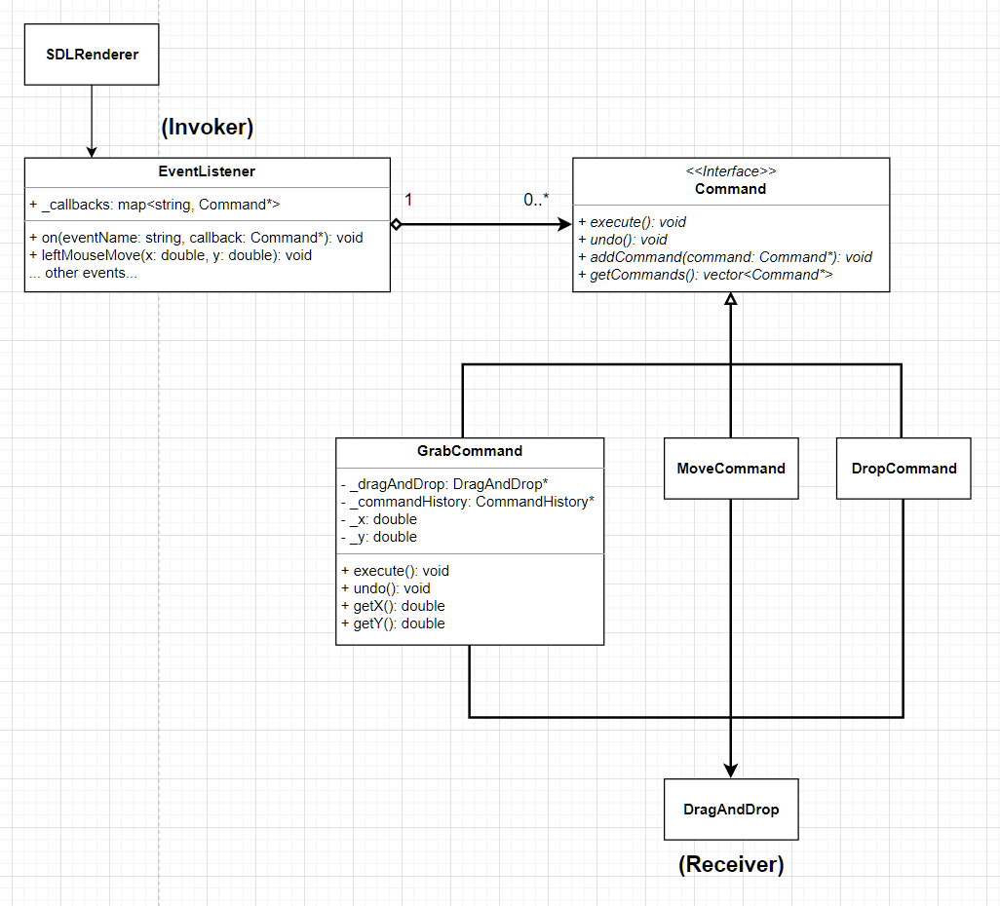

# Pattern Oriented Software Design 2022 Fall Assignment

## Assignment 6

#### Deadline: 12/19 Mon. 23:59

## Introduction

In this assignment, you are required to complete the drag and drop functionality with undo by implementing the `Command` pattern.

The deadline is at 23:59, 12/19(Mon.).


## Problem statement

This assignment includes two parts, the drag and drop function and the undo.
First we focus the drag and drop function.

### 1. Drag and drop

The drag and drop contains three actions: grab, move, and drop. When a user presses his/her mouse on an shape, we say that the user *grabs* the shape. Then, when the user moves his/her mouse on the screen while the mouse is being pressed, we say that the user *moves* the shape and that the shape should be moved with the mouse movement. These two actions, grab and move, are meant to *drag* the shape. When the user release the mouse at a place s/he likes, we say that the user *drops* the shape and that the shape should be placed at the place.


Below is the class diagram for the three actions, in which we have three commands for the three actions: `GrabCommand`, `MoveCommand`, and `DropCommand`.



`SDLRenderer` is the class responsible for rendering shapes on the screen. It can also detect events from user actions, such as mouse click or mouse move. Whenever it detects an event occurred, it notifies `EventListener` to carry out the corresponding callbacks.

The term *callback* refers to an `Command` instance that we register on the `EventListener`. The instance will be invoked when the registered event occurred.
For example, if we register an `GrabCommand` on the `EventListener` for the `Left_Mouse_Down` event, when the user click the left mouse button, the `SDLRenderer` will notify `EventListener` by calling the leftMouseDown method of the listener, and the `EventListener` will triggered the `GrabCommand` instance by calling the execute method of the command.
```c++
// graphics.cpp
EventListener eventListener;
eventListener.on("Left_Mouse_Down", new GrabCommand(...));

// event_listener.h
void leftMouseDown(...) {
  _callbacks["Left_Mouse_Down"]->execute();
}
```

We need to register three commands on the listener:

1. `GrabCommand` for the `Left_Mouse_Down`,
2. `MoveCommand` for the `Left_Mouse_Move`, and
3. `DropCommand` for the `Left_Mouse_Up`.

For these three commands, they both inherit from the `Command` interface and have the same receiver, the `DragAndDrop` component, which has been implemented for the drag and drop function. Therefore in the constructor of these commands, they should take the `DragAndDrop` instance as an argument and calls the corresponding method from the `DragAndDrop`.

The `GrabCommand` calls the `grab` from `DragAndDrop`. The `grab` takes the current position of the mouse as the arguments. So before calling the `drag`, the `GrabCommand` should ask the position of the mouse, same for the `MoveCommand` and `DropCommand`, which call the `move` and the `drop` respectively.

### 2. Undo

In this assignment, we also have to make the program support the undo function. The program undoes the previous action when the user clicks the right mouse button. For example, when the user drags and drops a shape from point A to point B, and then the user clicks the right mouse button, the shape should be moved back from B to A.


Below is the class diagram for undo.


There is a new command called `UndoCommand` that should be registered on the listener for the `Right_Mouse_Down` event. When the event is triggered, `UndoCommand` executes `undo` from `CommandHistory`.

`CommandHistory` is the class used to record the commands that have been executed. It has a `stack` for storing commands. Since the stack is Last-in-First-out (LIFO), the command executed lastly can be recovered firstly. For drag and drop, the `GrabCommand`, `MoveCommand`, and `DropCommand` should be stored in the history after being executed.

To undo an "drag and drop", we cannot solely undo a single grab, a single move or a single drop every time the user click right button. We need to undo the entire "drag and drop" to put the shape back to the original place. Therefore, we need `MacroCommand` to help us to store the commands of an "drag and drop" as a single command. For example, if we drag and drop a shape from point A to point B, we will have the sequence of the commands like below:

GrabCommand<br/>
MoveCommand<br/>
...<br/>
MoveCommand<br/>
DropCommand<br/>

These commands should be put in a `MacroCommand` that is stored in the command history rather than be put in the history directly. In the history since we have the `MacroCommand` that records the entire "drag and drop", if we need to undo the "drag and drop", we just undo the `MacroCommand`. We can also see there are two methods on `CommandHistory`, `beginMacroCommand` and `endMacroCommand`, indicating the history that in the following we are performing a series of commands that should be recorded a macro command.


This assignment asks you to implement `GrabCommand`, `MoveCommand`, and `DropCommand` to complete the drag and drop function and to implement `UndoCommand`, `MacroCommand`, and `CommandHistory` to complete the undo function.

## File structure

The file structure is as followed. The project has two parts: `src` and `test`. All unit tests should be implemented in `test` folder and all classes should be implemented in `src`. **Please follow our interface, file structure, and file name** because we will test your code with our test data. Although we will not modify your source code and just replace the test files, any compilation errors due to non-compliant change could fail the assignment.
```diff
 .
 ├── bin
 │   └── ut_all
 ├── src
 │   ├── builder
 |   |   ├── scanner.h
 |   |   ├── shape_builder.h
 |   |   └── shape_parser.h
 │   ├── graphics
+|   |   ├── drag_and_drop
+|   |   |   ├── command
+|   |   |   |   ├── command.h
+|   |   |   |   ├── grab_command.h
+|   |   |   |   ├── move_command.h
+|   |   |   |   ├── drop_command.h
+|   |   |   |   ├── undo_command.h
+|   |   |   |   ├── macro_command.h
+|   |   |   |   ├── command_history.h
+|   |   |   |   └── refresh_command.h
+|   |   |   ├── drag_and_drop.h
+|   |   |   └── mouse_position.h
 |   |   ├── sdl
 |   |   |   ├── piece
 |   |   |   |   ├── cir_piece.h
 |   |   |   |   ├── line_piece.h
 |   |   |   |   └── piece.h
 |   |   |   ├── sdl_renderer.h
 |   |   |   └── sdl.h
 |   |   ├── canvas.h
+|   |   ├── event_listener.h
 |   |   └── sdl_adapter.h
 │   ├── iterator
 |   |   ├── factory
 |   |   |   ├── iterator_factory.h
 |   |   |   ├── iterator_factory.cpp
 |   |   |   ├── bfs_iterator_factory.h
 |   |   |   ├── bfs_iterator_factory.cpp
 |   |   |   ├── dfs_iterator_factory.h
 |   |   |   ├── dfs_iterator_factory.cpp
 |   |   |   ├── list_iterator_factory.h
 |   |   |   └── list_iterator_factory.cpp
 │   │   ├── bfs_compound_iterator.h
 │   │   ├── dfs_compound_iterator.h
 |   |   ├── list_compound_iterator.h
 │   │   ├── iterator.h
 │   │   └── null_iterator.h
 │   ├── utils
 │   │   └── file_reader.h
 │   ├── visitor
 │   │   ├── shape_visitor.h
 │   │   └── collision_detector.h
 │   ├── bounding_box.h
 │   ├── circle.h
 │   ├── compound_shape.h
 │   ├── point.h
 │   ├── rectangle.h
 │   ├── shape.h
 │   ├── triangle.h
 │   ├── two_dimensional_vector.h
 │   └── graphics.cpp
 ├── test
 │   ├── builder
 |   |   ├── ut_scanner.h
 |   |   ├── ut_shape_builder.h
 |   |   └── ut_shape_parser.h
 │   ├── graphics
+|   |   ├── drag_and_drop
+|   |   |   ├── command
+|   |   |   |   ├── mock_command.h
+|   |   |   |   ├── ut_grab_command.h
+|   |   |   |   ├── ut_move_command.h
+|   |   |   |   ├── ut_drop_command.h
+|   |   |   |   ├── ut_undo_command.h
+|   |   |   |   ├── ut_macro_command.h
+|   |   |   |   └── ut_command_history.h
+|   |   |   └── mock_drag_and_drop.h
 |   |   ├── mock_sdl_renderer.h
 |   |   └── ut_sdl_adapter.h
 │   ├── iterator
 │   │   ├── ut_bfs_compound_iterator.h
 │   │   ├── ut_dfs_compound_iterator.h
 │   │   └── ut_null_iterator.h
 │   ├── utils
 │   │   ├── test_input.txt
 │   │   └── ut_file_reader.h
 │   ├── visitor
 │   │   └── ut_collision_detector.h
 │   ├── ut_bounding_box.h
 │   ├── ut_circle.h
 │   ├── ut_compound_shape.h
 │   ├── ut_main.cpp
 │   ├── ut_point.h
 │   ├── ut_rectangle.h
 │   ├── ut_triangle.h
 │   └── ut_two_dimensional_vector.h
 └── makefile
```

## Implementation

**This section describes all implementation conditions that you should abide by. Please read them carefully.**

For moving shapes, please copy the new implementation of the shape family. Since this is out of the scape of assignment 6, you do not need to write unit tests for them.

* [point.h](src/point.h)
* [two_dimensional_vector.h](src/two_dimensional_vector.h)
* [shape.h](src/shape.h)
* [circle.h](src/circle.h)
* [triangle.h](src/triangle.h)
* [rectangle.h](src/rectangle.h)
* [compound_shape.h](src/compound_shape.h)

Please also copy the files listed below to support the function.

* [graphics.app](src/graphics.cpp)
* [event_listener.h](src/graphics/event_listener.h)
* [the entire sdl folder](src/graphics/sdl)
* [the entire drag_and_drop folder](src/graphics/drag_and_drop)

### 1. Drag and drop

`Command`: a class defining the standard methods for the *Leaf* command and the *Composite* command.

`GrabCommand`: a class used to handle the "Left_Mouse_Down" event. It takes the `DragAndDrop` and `CommandHistory` instances as the arguments. `GrabCommand` does **NOT** own the `DragAndDrop` and `CommandHistory` instances so it does not delete their instance in the destructor.

* For the `execute`:
  1. `GradCommand` should ask the current position of the mouse by asking `MousePosition`, which is a singleton object. Then the command should store the xy got from `MousePosition` as the private member.
  2. `GradCommand` calls the `grab` method from `DragAndDrop` with the xy.
  3. `GradCommand` then should **copy** itself into the `CommandHistory`. So, `GradCommand` should have a **copy constructor** to copy itself, in which all data member of the command are copied to the new command instance. Remember to call `beginMacroCommand` before save the command.
* For the `undo`, `GradCommand` should call the `move` and the `drop` method from `DragAndDrop` to put the target shape to the original position.

`MoveCommand`: a class used to handle the "Left_Mouse_Move" event. Same as `GrabCommand`, it takes the `DragAndDrop` and `CommandHistory` instances as the arguments and does not own these instances.

* For the `execute`, `MoveCommand` acts like `GradCommand` except that it calls the `move` method instead of the `grab`.
* **Note that it depends on you whether `MoveCommand` should be put in the history.** Sometimes the move commands will be lost when the mouse moves due to the inherent flaws in the SDL library; as the result, the undo of the `MoveCommand`s could not make the shape return to the origin. The TA tests also do not test whether or not the `MoveCommand` is copied into the history.
* For the `undo`, `MoveCommand` should call the `move` method from `DragAndDrop`.

`DropCommand`: a class used to handle the `Left_Mouse_Up` event, with the same arguments of two commands above.

* For the `execute`, `DropCommand` acts like `GradCommand` except that it calls the `drop` method and calls `endMacroCommand` after saving its copied instance.
* For the `undo`, it should call the `grab` method from `DragAndDrop`.

### 2. Undo

`UndoCommand`: a class used to handle the `Right_Mouse_Down` event. It only takes a `CommandHistory` instance as an argument and does not own the instance.

* For the `execute` of `UndoCommand`, the command should call the `undo` from the `CommandHistory`. It does **NOT** copy itself into the history.
* For the `undo`, `UndoCommand` has no implementation because the `UndoCommand` is solely used to handle the event.

`CommandHistory`: a class used to record all executed commands in a stack. **It should have the ownership of all commands it stores in the stack**, meaning that it should delete all command instances in the destructor.

* When the client calls `addCommand` without the macro triggered, it simply put the command in the stack.
* When the client calls `beginMacroCommand`, a `MacroCommand` instance should be created and put in the stack. In the following `addCommand`, the command passed in should be put in the macro command at the top of the stack.
* When the client calls `endMacroCommand`, the "Macro" mode ends. The following commands passed in should be directly put in the stack.
* When the client calls `undo`, a command should be popped out from the stack and its undo should be called. The popped out command will not be delete immediately. In order to test the `CommandHistory`, the popped command should be placed in another container, say another stack, and be deleted in the destructor.

`MacroCommand`: a class used to bundle multiple commands as a single command. In this assignment, we use it to save a series of commands as single for undo. **It should have the ownership of the commands it has.**

Like `CompoundShape`, when the client calls the `execute` or `undo` of macro, the macro should call the `execute` or `undo` of the children command.


- **Each class method declared in header files must be implemented and have at least one test case.**
- **No more tests are required for the classes other than the mentioned above.**
- For all classes above, an exception should raise if we give any illegal input to the constructor. The exception type is not specified, which can be as simple as `string`.
- If the type of returned value is `double`, your assertion should compare the value with the error not greater than `0.001`.
- All `double` values should be rounded to two decimal place and be padded with 0 when turned into `string`, e.g., `-1.999` will be `"-2.00"`.
- You can use `M_PI` in `cmath` for calculation of π.
- You can use [GeoGebra](https://www.geogebra.org/calculator) to design your test data.

## Submission

Please use the [workspace](http://140.124.181.100/course/environment_setting) you have setup in assignment 1. If the setting is correct, whenever you push your code to the repository, the repository will trigger a test job titled `posd2022f_<student_id>_HW` from [the CI server](http://140.124.181.97:8080/). You can check whether your unit tests pass from the test job. Once all tests pass, another test job will be trigger, `posd2022f_<student_id>_HW_TA`. In this job, your code will be tested with our test data. You can also check whether your code pass all tests we made. Make sure all tests pass before the deadline.

## Grading Rubrics

- **One memory leak: one point deducted.**
- Unit tests written by yourself: 50%.
- Unit tests written by TA: 50%.

## You Will Get 0 Points If

- your test still cannot be executed after the deadline; for example, your code fails to compile or a unit test breaks due to a runtime exception;
- you unit tests pass in an unreasonable way; for example, all tests use `ASSERT_TRUE(true)`;
- your code is copied from another student's assignment.


## Notes

- For unit testing, consider as many cases as possible.
- Discussion is encouraged but the code must be your own.
- Feel free to contact us if you have any suggestions or concerns.

## References

- [POSD2022F course link](http://140.124.181.100/yccheng/posd2022f)
- [Environment setting](http://140.124.181.100/course/environment_setting)
- [Makefile tutorial](http://140.124.181.100/course/makefile_tutorial)
- [C++.com](http://www.cplusplus.com/reference/)
- [C++ exception handling](https://www.tutorialspoint.com/cplusplus/cpp_exceptions_handling.htm)
- [Vector introduction](https://mathinsight.org/cross_product_formula)
- [Magnitude(length) of a vector](https://mathinsight.org/definition/magnitude_vector)
- [Dot product formula](https://mathinsight.org/dot_product_formula_components)
- [Cross product formula](https://mathinsight.org/cross_product_formula)
- [GeoGebra](https://www.geogebra.org/calculator)
- [Depth-First Search](https://www.wikiwand.com/en/Depth-first_search)
- [Breadth-First Search](https://www.wikiwand.com/en/Breadth-first_search)
- [Stack and Heap Memory](https://courses.engr.illinois.edu/cs225/fa2022/resources/stack-heap/)
- [SDL tutorials](https://lazyfoo.net/tutorials/SDL/index.php)
- [Drag and drop](https://www.wikiwand.com/en/Drag_and_drop)
## TA Contact

    Name: James Jhang, Paul Lai
    Email: e8315402, xie57813 (gmail)
    Office room: 宏裕科技大樓 13F 1321(後門)
    Office hours: 10am - 12pm , Tue/Wed